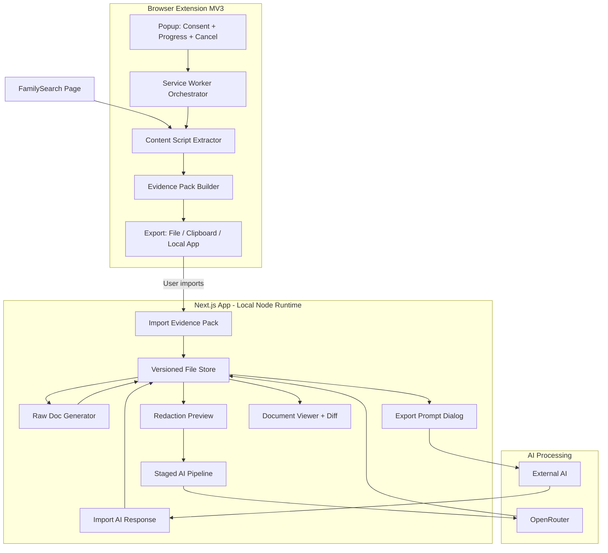
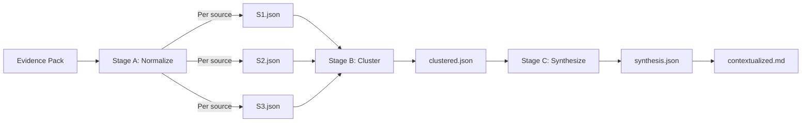

# FamilySearch Documentation Tool (v0.3)

## Goal

Produce two outputs per FamilySearch person:

1. **Raw Evidence Document** - Deterministic, lossless, no AI - the "court-admissible" record
2. **Contextualized Dossier** - AI-assisted synthesis with strict evidence/inference boundaries

---

## Operating Modes

### Standard Mode (Default)

- User-initiated extraction only
- Clear consent + visible progress + cancel button
- Paced expansion (human-speed, ~1-2 seconds between actions)
- Export-first (download/clipboard)
- Hard cap: max 50 source expansions per run

### Admin Mode (Testing/Development)

- Enabled via settings toggle (requires acknowledgment)
- Faster pacing for development testing
- No hard caps on expansions
- Direct send to local app (skips download step)
- Clearly labeled in UI: "ADMIN MODE - Testing Only"

---

## Compliance Guardrails

Both modes adhere to core principles:

- No batch runs across multiple people
- No automated traversal to other person pages
- No background retries without user action
- Visible progress indicator at all times
- "Assisted expand" is user-triggered, paced, cancellable
- Read-only behavior (no writes to FamilySearch)

> FamilySearch Terms prohibit bulk download/scraping without prior written permission.> Plug-in guidance emphasizes user consent, read-only behavior, and temporary storage.---

## Architecture



---

## Extension Architecture (MV3)

### Service Worker Orchestrator

The key addition - manages the extraction workflow:

```typescript
// Responsibilities:
// - Step-by-step extraction workflow
// - Pacing between DOM actions (configurable by mode)
// - Retry with exponential backoff
// - Progress reporting to popup
// - Cancellation handling
// - Timeout detection

interface ExtractionState {
  status: "idle" | "extracting" | "expanding" | "building" | "complete" | "error" | "cancelled";
  currentStep: number;
  totalSteps: number;
  currentSource?: string;
  expandedCount: number;
  errors: string[];
  startedAt: number;
}
```


### Extension File Structure

```javascript
extension/
├── manifest.json
├── service-worker.ts        # Orchestrator (new)
├── content/
│   ├── extractor.ts         # DOM reading
│   └── expander.ts          # Click handlers for "SHOW"
├── popup/
│   ├── index.html
│   ├── popup.tsx
│   └── components/
│       ├── ConsentScreen.tsx
│       ├── ProgressView.tsx
│       └── ExportOptions.tsx
├── lib/
│   ├── evidencePack.ts      # Schema + builder
│   ├── sourceKey.ts         # Hash generation
│   └── pacing.ts            # Timing controls per mode
└── types/
    └── index.ts
```

---

## Versioned Local Storage

Each extraction creates a new timestamped run:

```javascript
data/
└── people/
    └── KWCJ-4X6/
        ├── person.json              # Cached metadata
        ├── latest.json              # Points to latest run
        └── runs/
            └── 2026-01-08T10-30-00Z/
                ├── evidence-pack.json
                ├── raw-document.md
                ├── redacted-pack.json       # For AI (optional)
                ├── ai-stages/
                │   ├── normalized/
                │   │   ├── S1.json
                │   │   ├── S2.json
                │   │   └── ...
                │   ├── clustered.json
                │   └── synthesis.json
                └── contextualized.md
```

**Benefits:**

- Diff between runs ("what changed?")
- Re-run AI without re-scraping
- Full audit trail for genealogy evidence standards
- Incremental AI reprocessing (one source at a time)

---

## Evidence Pack Schema (Enhanced)

```typescript
interface EvidencePack {
  // Metadata
  schemaVersion: "1.0";
  runId: string;                    // UUID for this extraction
  capturedAt: string;               // ISO timestamp
  extractorVersion: string;
  extractionDurationMs: number;
  
  // Page context
  sourceUrl: string;
  pageTitle: string;
  uiLocale: string;                 // "en", "es", etc.
  
  // Person
  person: {
    familySearchId: string;
    name: string;
    birthDate?: string;
    deathDate?: string;
  };
  
  // Sources (enhanced)
  sources: Array<{
    // Identification
    id: string;                     // Local ID (S1, S2, ...)
    orderIndex: number;             // Preserve page ordering
    sourceKey: string;              // Hash of citation+url+title
    sourceType: "record" | "memory" | "story" | "photo" | "other";
    
    // Core data
    title: string;
    date?: string;
    citation?: string;
    webPageUrl?: string;
    attachedBy?: string;
    attachedAt?: string;
    reasonAttached?: string;
    tags: string[];
    
    // Indexed information
    indexed: {
      fields: Array<{
        label: string;
        labelRaw?: string;          // Original before normalization
        value: string;
      }>;
      textBlocks: string[];
    };
    rawText: string;
    
    // Expansion tracking
    expanded: boolean;
    expansionAttempts: number;
    expansionSucceeded: boolean;
  }>;
  
  // Diagnostics (structured)
  diagnostics: {
    mode: "standard" | "admin";
    totalSources: number;
    expandedSections: number;
    failedExpansions: number;
    warnings: Array<{
      code: "VIRTUALIZED_LIST" | "EXPAND_TIMEOUT" | "MISSING_FIELD" | "RATE_LIMITED";
      message: string;
      sourceId?: string;
    }>;
    errors: Array<{
      code: string;
      message: string;
      fatal: boolean;
    }>;
  };
}
```


### Source Key Generation

```typescript
function generateSourceKey(source: Source): string {
  const input = [
    source.citation || "",
    source.webPageUrl || "",
    source.title || ""
  ].join("|");
  
  return crypto.subtle.digest("SHA-256", new TextEncoder().encode(input))
    .then(hash => Array.from(new Uint8Array(hash))
      .map(b => b.toString(16).padStart(2, "0"))
      .join("")
      .slice(0, 16));  // First 16 chars
}
```

---

## Raw Document Format (with anchors)

```markdown
# Jennie Kathryn Gill
**FamilySearch ID:** KWCJ-4X6  
**Born:** 27 February 1898 | **Died:** 14 July 1988

---

## Extraction Metadata
| Field | Value |
|-------|-------|
| Run ID | `abc123-def456` |
| Captured | 2026-01-08T10:30:00Z |
| Source URL | https://familysearch.org/... |
| Extractor | v1.0.0 |
| Mode | standard |
| Duration | 45.2s |
| Sources | 24 total, 24 expanded |

---

## Sources

### S1: United States Census, 1910 {#S1}
**Source ID:** `S1`  
**Source Key:** `a1b2c3d4e5f6g7h8`  
**Type:** record  

**Date:** 1910  
**Attached by:** KarenPrestwich1 on August 24, 2013  
**Reason:** Shows Jenny living with her family

**Citation:**  
> "United States, Census, 1910", FamilySearch...

**Web Page:** [View Record](https://familysearch.org/ark:/...)

**Tags:** `Name` `Sex` `Birth`

#### Indexed Information
| Field | Value |
|-------|-------|
| Name | Jennie Gill |
| Sex | Female |
| Age | 12 years |
| Birthplace | Utah |
| Relationship | Daughter |

---
*End of Source S1 (captured from FamilySearch Sources page)*

---

### S2: United States Census, 1920 {#S2}
...
```

---

## Staged AI Pipeline (Schema-Locked)

### Zod Schemas

```typescript
// Stage A: Normalized Source
const NormalizedSourceSchema = z.object({
  sourceId: z.string(),                    // S1, S2, etc.
  summary: z.string(),                     // One sentence
  entities: z.array(z.object({
    name: z.string(),
    type: z.enum(["person", "place", "organization"]),
    role: z.string().optional(),
  })),
  dates: z.array(z.object({
    date: z.string(),
    type: z.string(),                      // birth, death, census, etc.
    precision: z.enum(["exact", "estimated", "range"]),
  })),
  places: z.array(z.object({
    name: z.string(),
    type: z.string(),                      // birthplace, residence, etc.
  })),
  relationships: z.array(z.object({
    person1: z.string(),
    person2: z.string(),
    type: z.string(),
  })),
  claims: z.array(z.string()),             // Key facts this source asserts
  confidence: z.enum(["high", "medium", "low"]),
});

// Stage B: Clusters
const ClusterSchema = z.object({
  clusters: z.array(z.object({
    id: z.string(),
    type: z.enum(["same_record", "same_event", "overlapping_info", "related"]),
    sourceIds: z.array(z.string()),
    reason: z.string(),
    primarySourceId: z.string(),           // Best representative
  })),
  standalone: z.array(z.string()),         // Sources not in any cluster
});

// Stage C: Synthesis
const SynthesisSchema = z.object({
  summary: z.string(),
  verifiedFacts: z.array(z.object({
    fact: z.string(),
    sourceIds: z.array(z.string()),
    confidence: z.enum(["high", "medium", "low"]),
  })),
  conflicts: z.array(z.object({
    description: z.string(),
    positions: z.array(z.object({
      claim: z.string(),
      sourceIds: z.array(z.string()),
    })),
  })),
  timeline: z.array(z.object({
    date: z.string(),
    event: z.string(),
    sourceIds: z.array(z.string()),
  })),
  researchSuggestions: z.array(z.string()),
});
```


### Stage Processing Flow



**Validation rule:** If AI output fails Zod validation, reject and retry (or surface error to user).---

## Privacy: Redaction Preview

Before sending to OpenRouter:

1. **Preview screen** shows exactly what will be sent
2. **Automatic redaction** of:

- Email addresses
- Phone numbers  
- Full street addresses
- Notes containing "living" indicators

3. **User toggle** for additional redaction
4. **Save** `redacted-pack.json` alongside original for audit

---

## Next.js App Structure

```javascript
app/
├── layout.tsx
├── page.tsx                      # Dashboard
├── person/
│   └── [id]/
│       ├── page.tsx              # Person overview
│       ├── raw/page.tsx          # Raw document view
│       ├── ai/page.tsx           # AI processing controls
│       └── diff/page.tsx         # Compare runs
├── settings/
│   └── page.tsx                  # API key, mode toggle
└── api/
    ├── import/route.ts           # Accept Evidence Pack
    ├── people/route.ts           # List people
    ├── people/[id]/
    │   ├── route.ts              # Person metadata
    │   ├── runs/route.ts         # List runs
    │   └── runs/[runId]/
    │       ├── raw/route.ts      # Generate/serve raw doc
    │       └── process/route.ts  # Run AI stage
    └── settings/route.ts

components/
├── ui/                           # ShadCN
├── Dashboard.tsx
├── PersonCard.tsx
├── RunSelector.tsx
├── RawDocumentViewer.tsx
├── ContextualizedViewer.tsx
├── RedactionPreview.tsx
├── ExportPromptDialog.tsx
├── ImportResultsDialog.tsx
└── RunDiffViewer.tsx

lib/
├── schemas/
│   ├── evidencePack.ts           # Zod schema
│   ├── normalized.ts
│   ├── clustered.ts
│   └── synthesis.ts
├── storage.ts                    # File operations
├── rawDocGenerator.ts            # Deterministic markdown
├── redactor.ts                   # Privacy filtering
├── openrouter.ts                 # API client
└── prompts/
    ├── normalize.ts
    ├── cluster.ts
    └── synthesize.ts
```

---

## Implementation Order

| Phase | Focus | Deliverable ||-------|-------|-------------|| 1 | Extension Core | MV3 setup, popup UI, consent screen || 2 | Extraction | Content script, service worker orchestrator, pacing || 3 | Evidence Pack | Schema, builder, source key hashing, export || 4 | Next.js Shell | Import, versioned storage, dashboard || 5 | Raw Document | Deterministic generator with anchors || 6 | AI Pipeline | Zod schemas, staged processing, validation || 7 | Privacy | Redaction preview, filtered export || 8 | Export/Import | External AI workflow dialogs || 9 | Polish | Diff viewer, error handling, admin mode |---

## Future: FamilySearch API Migration

When API access approved:

- Create `lib/apiIngestor.ts` outputting same Evidence Pack format
- Add OAuth flow in settings