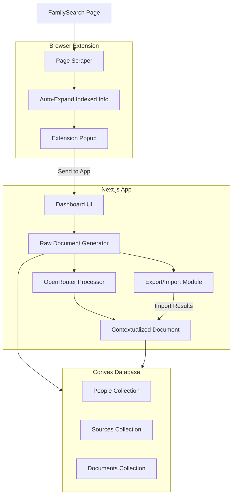

# FamilySearch Documentation Tool

## Architecture Overview



---

## Phase 1: Project Setup

- Initialize Next.js 14 app with App Router
- Configure Tailwind CSS and ShadCN UI components
- Set up Convex database with schema for People, Sources, and Documents
- Create base Chrome extension structure (manifest v3)

---

## Phase 2: Browser Extension

The extension will:

1. **Detect FamilySearch pages** - Activate when on `familysearch.org/tree/person/sources/*` URLs
2. **Auto-expand indexed information** - Programmatically click all "SHOW" buttons to reveal hidden data
3. **Extract structured data** including:

- Person info (name, dates, ID)
- All sources with metadata (date, title, created by, tags)
- Indexed information from each source (the key genealogical data)
- Web page links and citations
- Reason statements

4. **Send to Next.js app** via local API or clipboard export

**Key files:**

- `extension/manifest.json` - Extension configuration
- `extension/content.js` - Page scraping logic
- `extension/popup.html/js` - Extension UI with "Extract" button

---

## Phase 3: Next.js App Core

### Pages/Routes:

- `/` - Dashboard listing all captured people
- `/person/[id]` - View person with raw + contextualized docs
- `/settings` - OpenRouter API key configuration

### Key Components:

- `PersonCard` - Summary card for dashboard
- `RawDocumentViewer` - Displays extracted raw data in clean markdown
- `ContextualizedDocument` - AI-enhanced formatted report
- `ExportPromptDialog` - Generates prompt + JSON for external AI
- `ImportResultsDialog` - Paste JSON response from external AI

---

## Phase 4: Document Generation

### Raw Document Format

Markdown document with sections:

- Person Overview (name, dates, ID)
- Sources List (all sources with full details)
- Indexed Information (expanded data from each source)
- Citations and Links

### Contextualized Document (AI-Generated)

- Executive Summary
- Verified Facts (with source citations)
- Potential Duplicates/Repetition Analysis
- Interpretations and Connections
- Research Suggestions
- Timeline of Events

---

## Phase 5: AI Integration

### OpenRouter In-App Processing

- API route `/api/process` that calls OpenRouter
- Configurable model selection (GPT-4, Claude, etc.)
- Streaming response for long documents
- Store results in Convex

### Export/Import Workflow

- **Export**: Generate a comprehensive prompt + raw JSON data as copyable text
- **Import**: Paste structured JSON response, app parses and stores contextualized document

---

## Data Schema (Convex)

```typescript
// People - the genealogical subjects
people: {
  familySearchId: string,      // e.g., "KWCJ-4X6"
  name: string,
  birthDate: string,
  deathDate: string,
  extractedAt: number,
}

// Sources - individual source records
sources: {
  personId: Id<"people">,
  title: string,
  date: string,
  citation: string,
  webPageUrl: string,
  indexedInfo: object,         // The valuable expanded data
  tags: string[],
  createdBy: string,
  reasonAttached: string,
}

// Documents - generated outputs
documents: {
  personId: Id<"people">,
  type: "raw" | "contextualized",
  content: string,             // Markdown content
  generatedAt: number,
  aiModel: string,             // Which model generated it
}
```

---

## File Structure

```javascript
/FamilyHistory/
├── extension/                    # Chrome Extension
│   ├── manifest.json
│   ├── content.js               # Page scraping
│   ├── popup.html
│   ├── popup.js
│   └── styles.css
├── app/                         # Next.js App
│   ├── layout.tsx
│   ├── page.tsx                 # Dashboard
│   ├── person/[id]/page.tsx
│   ├── settings/page.tsx
│   └── api/
│       └── process/route.ts     # OpenRouter API
├── components/
│   ├── ui/                      # ShadCN components
│   ├── PersonCard.tsx
│   ├── RawDocumentViewer.tsx
│   ├── ContextualizedDocument.tsx
│   ├── ExportPromptDialog.tsx
│   └── ImportResultsDialog.tsx
├── convex/
│   ├── schema.ts
│   ├── people.ts
│   ├── sources.ts
│   └── documents.ts
├── lib/
│   ├── openrouter.ts            # OpenRouter client
│   └── prompts.ts               # AI prompt templates
└── package.json
```

---

## Future Enhancement: FamilySearch API

Once API access is approved:

- Add OAuth flow for FamilySearch authentication
- Create `/api/familysearch/[personId]` route