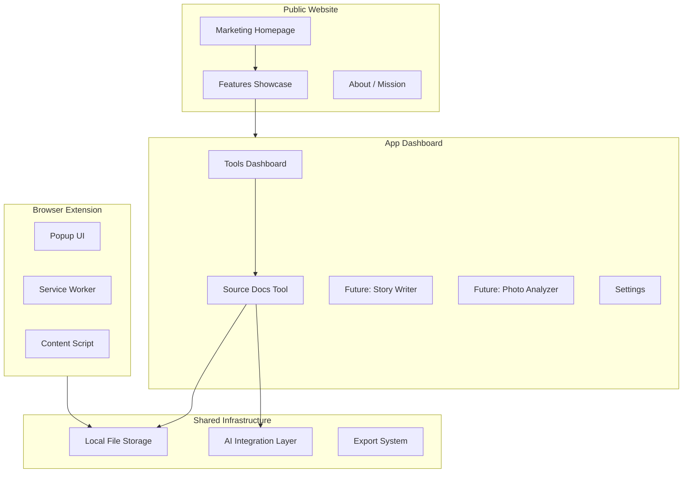
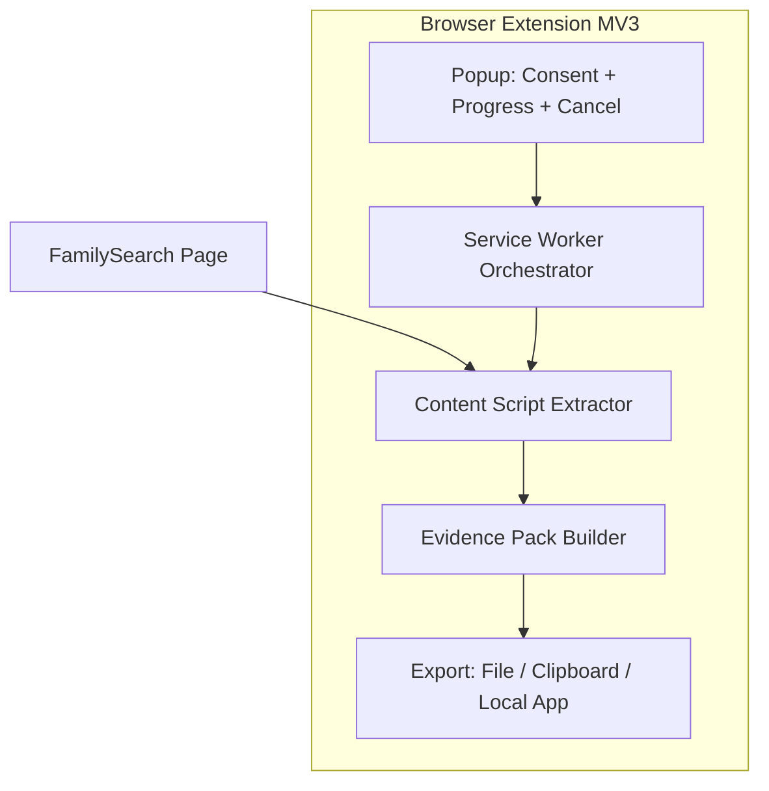
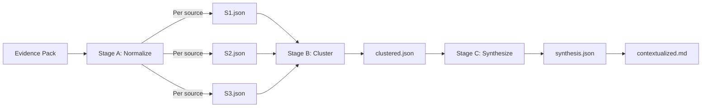

# Tell Their Stories

## A Family History AI Toolset - Complete Specification

---

## Vision

A platform for family historians who want to go beyond names and dates. While traditional genealogy focuses on building trees and finding records, **Tell Their Stories** focuses on:

- **Research depth** - Understanding context, not just collecting facts
- **Storytelling** - Turning data into compelling narratives
- **Content creation** - Photos, documents, timelines, and shareable stories
- **AI assistance** - Leveraging modern AI to do the heavy lifting

---

# Part 1: Platform Architecture

## Overall System Design



---

## Website Structure

### Public Pages (Marketing)

| Route | Purpose |

|-------|---------|

| `/` | Hero homepage with value proposition, feature highlights, CTA |

| `/features` | Overview of all tools with descriptions and previews |

| `/features/source-docs` | Deep dive on Source Documentation Tool |

| `/about` | Mission, story, why this exists |

| `/roadmap` | Upcoming features, transparency about development |

### App Pages (Tools)

| Route | Purpose |

|-------|---------|

| `/app` | Dashboard - all tools at a glance, recent activity |

| `/app/source-docs` | FamilySearch Source Documentation Tool |

| `/app/source-docs/[personId]` | Individual person workspace |

| `/app/source-docs/[personId]/raw` | Raw document view |

| `/app/source-docs/[personId]/ai` | AI processing controls |

| `/app/source-docs/[personId]/diff` | Compare runs |

| `/app/settings` | API keys, preferences, admin mode |

---

## Design Philosophy

### Visual Identity

- **Name**: Tell Their Stories
- **Tagline**: "A Family History AI Toolset"
- **Tone**: Warm, approachable, but professional
- **Aesthetic**: 
  - Warm earth tones mixed with modern accents
  - Typography that feels both historical and readable
  - Subtle textures or paper-like elements
  - Clean, uncluttered interfaces for the tools

### UX Principles

1. **Get stuff done** - Tools should be immediately useful
2. **Progressive disclosure** - Simple by default, powerful when needed
3. **Export everything** - Users own their data
4. **AI as assistant** - AI helps, but user stays in control
5. **Storytelling focus** - Every feature contributes to telling stories

---

## Project Structure (Modular)

```
/FamilyHistory/
├── extension/                        # Browser extension (separate build)
│   ├── manifest.json
│   ├── service-worker.ts
│   ├── content/
│   │   ├── extractor.ts
│   │   └── expander.ts
│   ├── popup/
│   │   ├── index.html
│   │   ├── popup.tsx
│   │   └── components/
│   │       ├── ConsentScreen.tsx
│   │       ├── ProgressView.tsx
│   │       └── ExportOptions.tsx
│   ├── lib/
│   │   ├── evidencePack.ts
│   │   ├── sourceKey.ts
│   │   └── pacing.ts
│   └── types/
│       └── index.ts
│
├── app/                              # Next.js App Router
│   ├── layout.tsx                    # Root layout with nav
│   ├── page.tsx                      # Marketing homepage
│   ├── features/
│   │   ├── page.tsx
│   │   └── source-docs/page.tsx
│   ├── about/page.tsx
│   ├── roadmap/page.tsx
│   │
│   └── (app)/                        # App routes (tools)
│       ├── layout.tsx                # App layout with sidebar
│       ├── page.tsx                  # Dashboard
│       ├── source-docs/
│       │   ├── page.tsx
│       │   └── [personId]/
│       │       ├── page.tsx
│       │       ├── raw/page.tsx
│       │       ├── ai/page.tsx
│       │       └── diff/page.tsx
│       └── settings/page.tsx
│
├── components/
│   ├── ui/                           # ShadCN components
│   ├── layout/
│   │   ├── MarketingNav.tsx
│   │   ├── AppSidebar.tsx
│   │   ├── Footer.tsx
│   │   └── FeatureCard.tsx
│   ├── marketing/
│   │   ├── Hero.tsx
│   │   ├── FeatureShowcase.tsx
│   │   └── CTASection.tsx
│   └── shared/
│       ├── DocumentViewer.tsx
│       ├── ExportDialog.tsx
│       └── AIProcessingStatus.tsx
│
├── features/                         # Feature modules
│   └── source-docs/
│       ├── components/
│       │   ├── PersonCard.tsx
│       │   ├── RunSelector.tsx
│       │   ├── RawDocumentViewer.tsx
│       │   ├── ContextualizedViewer.tsx
│       │   ├── RedactionPreview.tsx
│       │   ├── ExportPromptDialog.tsx
│       │   └── ImportResultsDialog.tsx
│       ├── lib/
│       │   ├── schemas.ts
│       │   ├── rawDocGenerator.ts
│       │   ├── redactor.ts
│       │   └── prompts/
│       │       ├── normalize.ts
│       │       ├── cluster.ts
│       │       └── synthesize.ts
│       └── types/
│
├── lib/                              # Shared utilities
│   ├── storage/
│   │   ├── fileStorage.ts
│   │   └── types.ts
│   ├── ai/
│   │   ├── openrouter.ts
│   │   ├── promptBuilder.ts
│   │   └── validation.ts
│   └── utils/
│
├── data/                             # Local file storage (gitignored)
│   └── source-docs/
│       └── people/
│
├── public/
│   ├── images/
│   └── fonts/
│
└── package.json
```

---

# Part 2: Source Documentation Tool - Full Specification

## Goal

Produce two outputs per FamilySearch person:

1. **Raw Evidence Document** - Deterministic, lossless, no AI - the "court-admissible" record
2. **Contextualized Dossier** - AI-assisted synthesis with strict evidence/inference boundaries

---

## Operating Modes

### Standard Mode (Default)

- User-initiated extraction only
- Clear consent + visible progress + cancel button
- Paced expansion (~1-2 seconds between actions)
- Export-first (download/clipboard)
- Hard cap: max 50 source expansions per run

### Admin Mode (Testing/Development)

- Enabled via settings toggle (requires acknowledgment)
- Faster pacing for development testing
- No hard caps on expansions
- Direct send to local app
- Clearly labeled: "ADMIN MODE - Testing Only"

---

## Compliance Guardrails

Both modes adhere to:

- No batch runs across multiple people
- No automated traversal to other person pages
- No background retries without user action
- Visible progress indicator at all times
- "Assisted expand" is user-triggered, paced, cancellable
- Read-only behavior (no writes to FamilySearch)

---

## Browser Extension Architecture (MV3)

### Data Flow



### Service Worker Orchestrator

Manages the extraction workflow:

```typescript
interface ExtractionState {
  status: "idle" | "extracting" | "expanding" | "building" | "complete" | "error" | "cancelled";
  currentStep: number;
  totalSteps: number;
  currentSource?: string;
  expandedCount: number;
  errors: string[];
  startedAt: number;
}

// Responsibilities:
// - Step-by-step extraction workflow
// - Pacing between DOM actions (configurable by mode)
// - Retry with exponential backoff
// - Progress reporting to popup
// - Cancellation handling
// - Timeout detection
```

---

## Evidence Pack Schema (Full)

```typescript
interface EvidencePack {
  // Metadata
  schemaVersion: "1.0";
  runId: string;                    // UUID for this extraction
  capturedAt: string;               // ISO timestamp
  extractorVersion: string;
  extractionDurationMs: number;
  
  // Page context
  sourceUrl: string;
  pageTitle: string;
  uiLocale: string;                 // "en", "es", etc.
  
  // Person
  person: {
    familySearchId: string;
    name: string;
    birthDate?: string;
    deathDate?: string;
  };
  
  // Sources
  sources: Array<{
    // Identification
    id: string;                     // Local ID (S1, S2, ...)
    orderIndex: number;             // Preserve page ordering
    sourceKey: string;              // Hash of citation+url+title
    sourceType: "record" | "memory" | "story" | "photo" | "other";
    
    // Core data
    title: string;
    date?: string;
    citation?: string;
    webPageUrl?: string;
    attachedBy?: string;
    attachedAt?: string;
    reasonAttached?: string;
    tags: string[];
    
    // Indexed information
    indexed: {
      fields: Array<{
        label: string;
        labelRaw?: string;
        value: string;
      }>;
      textBlocks: string[];
    };
    rawText: string;
    
    // Expansion tracking
    expanded: boolean;
    expansionAttempts: number;
    expansionSucceeded: boolean;
  }>;
  
  // Diagnostics
  diagnostics: {
    mode: "standard" | "admin";
    totalSources: number;
    expandedSections: number;
    failedExpansions: number;
    warnings: Array<{
      code: "VIRTUALIZED_LIST" | "EXPAND_TIMEOUT" | "MISSING_FIELD" | "RATE_LIMITED";
      message: string;
      sourceId?: string;
    }>;
    errors: Array<{
      code: string;
      message: string;
      fatal: boolean;
    }>;
  };
}
```

### Source Key Generation

```typescript
async function generateSourceKey(source: Source): Promise<string> {
  const input = [
    source.citation || "",
    source.webPageUrl || "",
    source.title || ""
  ].join("|");
  
  const hash = await crypto.subtle.digest(
    "SHA-256", 
    new TextEncoder().encode(input)
  );
  
  return Array.from(new Uint8Array(hash))
    .map(b => b.toString(16).padStart(2, "0"))
    .join("")
    .slice(0, 16);
}
```

---

## Versioned Local Storage

Each extraction creates a timestamped run:

```
data/source-docs/people/
└── KWCJ-4X6/
    ├── person.json              # Cached metadata
    ├── latest.json              # Points to latest run
    └── runs/
        └── 2026-01-08T10-30-00Z/
            ├── evidence-pack.json
            ├── raw-document.md
            ├── redacted-pack.json       # For AI (optional)
            ├── ai-stages/
            │   ├── normalized/
            │   │   ├── S1.json
            │   │   ├── S2.json
            │   │   └── ...
            │   ├── clustered.json
            │   └── synthesis.json
            └── contextualized.md
```

**Benefits:**

- Diff between runs ("what changed?")
- Re-run AI without re-scraping
- Full audit trail
- Incremental AI reprocessing

---

## Raw Document Format

```markdown
# Jennie Kathryn Gill
**FamilySearch ID:** KWCJ-4X6  
**Born:** 27 February 1898 | **Died:** 14 July 1988

---

## Extraction Metadata
| Field | Value |
|-------|-------|
| Run ID | `abc123-def456` |
| Captured | 2026-01-08T10:30:00Z |
| Source URL | https://familysearch.org/... |
| Extractor | v1.0.0 |
| Mode | standard |
| Duration | 45.2s |
| Sources | 24 total, 24 expanded |

---

## Sources

### S1: United States Census, 1910 {#S1}
**Source ID:** `S1`  
**Source Key:** `a1b2c3d4e5f6g7h8`  
**Type:** record  

**Date:** 1910  
**Attached by:** KarenPrestwich1 on August 24, 2013  
**Reason:** Shows Jenny living with her family

**Citation:**  
> "United States, Census, 1910", FamilySearch...

**Web Page:** [View Record](https://familysearch.org/ark:/...)

**Tags:** `Name` `Sex` `Birth`

#### Indexed Information
| Field | Value |
|-------|-------|
| Name | Jennie Gill |
| Sex | Female |
| Age | 12 years |
| Birthplace | Utah |
| Relationship | Daughter |

---
*End of Source S1 (captured from FamilySearch Sources page)*

---

### S2: United States Census, 1920 {#S2}
...
```

---

## Staged AI Pipeline

### Flow



### Zod Schemas

```typescript
// Stage A: Normalized Source
const NormalizedSourceSchema = z.object({
  sourceId: z.string(),
  summary: z.string(),
  entities: z.array(z.object({
    name: z.string(),
    type: z.enum(["person", "place", "organization"]),
    role: z.string().optional(),
  })),
  dates: z.array(z.object({
    date: z.string(),
    type: z.string(),
    precision: z.enum(["exact", "estimated", "range"]),
  })),
  places: z.array(z.object({
    name: z.string(),
    type: z.string(),
  })),
  relationships: z.array(z.object({
    person1: z.string(),
    person2: z.string(),
    type: z.string(),
  })),
  claims: z.array(z.string()),
  confidence: z.enum(["high", "medium", "low"]),
});

// Stage B: Clusters
const ClusterSchema = z.object({
  clusters: z.array(z.object({
    id: z.string(),
    type: z.enum(["same_record", "same_event", "overlapping_info", "related"]),
    sourceIds: z.array(z.string()),
    reason: z.string(),
    primarySourceId: z.string(),
  })),
  standalone: z.array(z.string()),
});

// Stage C: Synthesis
const SynthesisSchema = z.object({
  summary: z.string(),
  verifiedFacts: z.array(z.object({
    fact: z.string(),
    sourceIds: z.array(z.string()),
    confidence: z.enum(["high", "medium", "low"]),
  })),
  conflicts: z.array(z.object({
    description: z.string(),
    positions: z.array(z.object({
      claim: z.string(),
      sourceIds: z.array(z.string()),
    })),
  })),
  timeline: z.array(z.object({
    date: z.string(),
    event: z.string(),
    sourceIds: z.array(z.string()),
  })),
  researchSuggestions: z.array(z.string()),
});
```

**Validation rule:** If AI output fails Zod validation, reject and retry or surface error to user.

---

## Contextualized Document Format

```markdown
# Contextualized Dossier: Jennie Kathryn Gill

## Executive Summary
Brief overview of what we know about this person based on 24 sources...

## Verified Facts
| Fact | Sources | Confidence |
|------|---------|------------|
| Born ~1898 in Utah | S1, S2, S3 | High |
| Daughter of Mary J Gill | S1, S2 | High |
| ... | ... | ... |

## Source Analysis

### Duplicate/Repetition Groups
- **Census Records**: S1, S2, S3, S4 all represent decennial census records...
- **Marriage Records**: S12, S15 appear to reference the same marriage...

### Conflicts & Ambiguities
- Birth year varies: 1898 (S1, S3) vs 1900 (S2 estimated)...

## Timeline
| Date | Event | Sources |
|------|-------|---------|
| 1898 | Born, Utah | S1, S2, S3 |
| 1910 | Living with parents, age 12 | S1 |
| 1920 | Living with mother, age 20, single | S2 |
| ... | ... | ... |

## Research Suggestions
1. No death certificate attached - consider searching Utah death records
2. Marriage records suggest spouse - search for spouse's records
3. ...
```

---

## Privacy: Redaction Preview

Before sending to OpenRouter:

1. **Preview screen** shows exactly what will be sent
2. **Automatic redaction** of:

   - Email addresses
   - Phone numbers  
   - Full street addresses
   - Notes containing "living" indicators

3. **User toggle** for additional redaction
4. **Save** `redacted-pack.json` alongside original for audit

---

## Dual AI Processing Modes

### Mode A: In-App (OpenRouter)

- Configure API key in settings
- Select model (Claude, GPT-4, etc.)
- Run stages directly with streaming
- Best for quick iteration

### Mode B: Export/Import

- **Export**: Generate prompt + Evidence Pack as copyable text
- User pastes into external AI (o1-pro, deep research, etc.)
- **Import**: Paste JSON response back, app validates and stores
- Best for complex cases needing expensive models

---

# Part 3: Marketing Pages

## Homepage Hero

```
┌─────────────────────────────────────────────────────────────┐
│                                                             │
│  [Nav: Tell Their Stories | Features | About | Get Started] │
│                                                             │
│         Tell Their Stories                                  │
│         ─────────────────                                   │
│         A Family History AI Toolset                         │
│                                                             │
│         Go beyond names and dates.                          │
│         Research deeply. Create content.                    │
│         Tell their stories.                                 │
│                                                             │
│         [Get Started] [See Features]                        │
│                                                             │
│         [Visual: vintage photo + document + AI glow]        │
│                                                             │
└─────────────────────────────────────────────────────────────┘
```

## Feature Cards

```
┌─────────────────────────────────────────────────────────────┐
│                      Our Tools                              │
│                                                             │
│  ┌─────────────┐  ┌─────────────┐  ┌─────────────┐         │
│  │ Source Docs │  │ Story       │  │ Coming      │         │
│  │ ─────────── │  │ Writer      │  │ Soon...     │         │
│  │ Extract &   │  │ ─────────── │  │             │         │
│  │ document    │  │ Turn facts  │  │ Timeline    │         │
│  │ FamilySearch│  │ into        │  │ Photo AI    │         │
│  │ sources     │  │ narratives  │  │ Research    │         │
│  │             │  │             │  │ Planner     │         │
│  │ [Try Now]   │  │ [Soon]      │  │             │         │
│  └─────────────┘  └─────────────┘  └─────────────┘         │
│                                                             │
└─────────────────────────────────────────────────────────────┘
```

## Value Props

```
┌─────────────────────────────────────────────────────────────┐
│   Why Tell Their Stories?                                   │
│                                                             │
│   ✓ Research, not just collect                              │
│     Go deep on context, conflicts, and connections          │
│                                                             │
│   ✓ AI that understands genealogy                           │
│     Purpose-built prompts for family history work           │
│                                                             │
│   ✓ Your data, your control                                 │
│     Everything exports. Nothing locked in.                  │
│                                                             │
│   ✓ Storytelling focus                                      │
│     Because ancestors deserve more than a database row      │
│                                                             │
└─────────────────────────────────────────────────────────────┘
```

---

# Part 4: Future Features Roadmap

| Feature | Description | Status |

|---------|-------------|--------|

| **Source Docs** | Extract, document, contextualize FamilySearch sources | Building |

| **Story Writer** | AI-assisted narrative generation from documented facts | Planned |

| **Photo Analyzer** | Extract info from old photos, identify people/places | Idea |

| **Timeline Builder** | Visual timeline from multiple sources | Idea |

| **Research Planner** | Track research goals, suggest next steps | Idea |

| **Document Transcriber** | OCR + AI transcription of handwritten docs | Idea |

| **Family Group Sheet** | Generate formatted family sheets from data | Idea |

Each feature follows the same modular pattern in `features/[name]/`.

---

# Part 5: Implementation Order

| Phase | Focus | Deliverables |

|-------|-------|--------------|

| **0.1** | Project Setup | Next.js, Tailwind, ShadCN, folder structure |

| **0.2** | Marketing Site | Homepage, features page, about, roadmap |

| **0.3** | App Shell | Dashboard, sidebar, settings, placeholders |

| **0.4** | Shared Infra | Storage utils, AI layer, export system |

| **1.1** | Extension Core | MV3 manifest, popup, consent UI |

| **1.2** | Extension Extract | Content script, orchestrator, Evidence Pack |

| **1.3** | Extension Export | Download, clipboard, local app send |

| **2.1** | Source Docs Import | Import route, Zod validation, storage |

| **2.2** | Source Docs List | People list, person workspace |

| **2.3** | Raw Document | Deterministic generator with anchors |

| **2.4** | AI Pipeline | Zod schemas, staged processing |

| **2.5** | AI UI | Processing controls, contextualized viewer |

| **2.6** | Export/Import | External AI workflow |

| **3.0** | Polish | Error handling, UX refinement |

---

# Part 6: Tech Stack

| Layer | Technology |

|-------|------------|

| Framework | Next.js 14 (App Router) |

| Styling | Tailwind CSS |

| Components | ShadCN UI |

| Validation | Zod |

| AI | OpenRouter API |

| Storage | Local filesystem (data/) |

| Extension | Chrome MV3, TypeScript |

| Build | pnpm |

---

# Part 7: Success Criteria

## Platform Launch

- [ ] Marketing homepage live and compelling
- [ ] App shell functional with navigation
- [ ] Settings page with API key management
- [ ] Modular architecture proven

## Source Docs MVP

- [ ] Extension extracts FamilySearch sources reliably
- [ ] Evidence Pack imports and stores correctly
- [ ] Raw document generates deterministically
- [ ] AI pipeline produces useful contextualized output
- [ ] Export/Import workflow functional

## Ready for Next Feature

- [ ] Clear pattern for adding new features
- [ ] Shared infrastructure working well
- [ ] Documentation for extending platform

---

# Part 8: FamilySearch API Migration (Future)

When API access approved:

- Create `lib/apiIngestor.ts` outputting same Evidence Pack format
- Add OAuth flow in settings
- All downstream (raw doc, AI pipeline) remains unchanged
- Extension becomes optional convenience tool