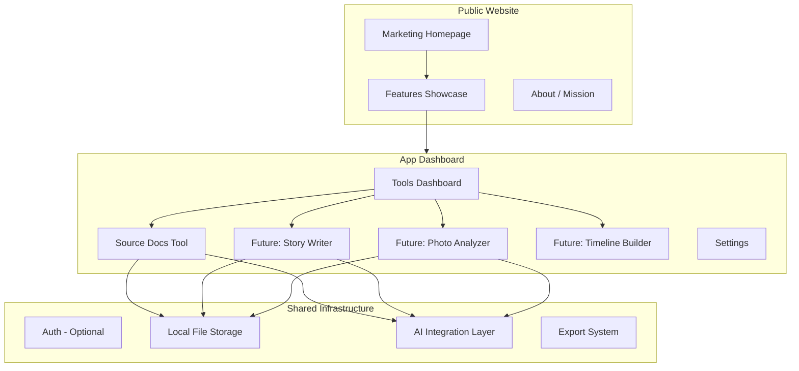

# Tell Their Stories

## A Family History AI Toolset

---

## Vision

A platform for family historians who want to go beyond names and dates. While traditional genealogy focuses on building trees and finding records, **Tell Their Stories** focuses on:

- **Research depth** - Understanding context, not just collecting facts
- **Storytelling** - Turning data into compelling narratives
- **Content creation** - Photos, documents, timelines, and shareable stories
- **AI assistance** - Leveraging modern AI to do the heavy lifting

---

## Platform Architecture



---

## Website Structure

### Public Pages (Marketing)

| Route | Purpose |

|-------|---------|

| `/` | Hero homepage with value proposition, feature highlights, CTA |

| `/features` | Overview of all tools with descriptions and previews |

| `/features/source-docs` | Deep dive on Source Documentation Tool |

| `/about` | Mission, story, why this exists |

| `/roadmap` | Upcoming features, transparency about development |

### App Pages (Tools)

| Route | Purpose |

|-------|---------|

| `/app` | Dashboard - all tools at a glance, recent activity |

| `/app/source-docs` | FamilySearch Source Documentation Tool |

| `/app/source-docs/[personId]` | Individual person workspace |

| `/app/settings` | API keys, preferences, admin mode |

| `/app/[future-feature]` | Placeholder for future tools |---

## Design Philosophy

### Visual Identity

- **Name**: Tell Their Stories
- **Tagline**: "A Family History AI Toolset"
- **Tone**: Warm, approachable, but professional. Not sterile corporate.
- **Aesthetic**: 
- Warm earth tones mixed with modern accents
- Typography that feels both historical and readable
- Subtle textures or paper-like elements nodding to documents/photos
- Clean, uncluttered interfaces for the actual tools

### UX Principles

1. **Get stuff done** - Tools should be immediately useful, not require hours of setup
2. **Progressive disclosure** - Simple by default, powerful when needed
3. **Export everything** - Users own their data, can take it anywhere
4. **AI as assistant** - AI helps, but user stays in control
5. **Storytelling focus** - Every feature should contribute to telling stories

---

## Project Structure (Modular)

```javascript
/FamilyHistory/
├── extension/                        # Browser extension (separate)
│   └── ...
│
├── app/                              # Next.js App Router
│   ├── layout.tsx                    # Root layout with nav
│   ├── page.tsx                      # Marketing homepage
│   ├── features/
│   │   ├── page.tsx                  # Features overview
│   │   └── source-docs/page.tsx      # Source docs feature page
│   ├── about/page.tsx
│   ├── roadmap/page.tsx
│   │
│   └── (app)/                        # App routes (tools)
│       ├── layout.tsx                # App layout with sidebar
│       ├── page.tsx                  # Dashboard
│       ├── source-docs/
│       │   ├── page.tsx              # Source docs home
│       │   └── [personId]/
│       │       ├── page.tsx          # Person workspace
│       │       ├── raw/page.tsx
│       │       ├── ai/page.tsx
│       │       └── diff/page.tsx
│       └── settings/page.tsx
│
├── components/
│   ├── ui/                           # ShadCN components
│   ├── layout/
│   │   ├── MarketingNav.tsx
│   │   ├── AppSidebar.tsx
│   │   ├── Footer.tsx
│   │   └── FeatureCard.tsx
│   ├── marketing/
│   │   ├── Hero.tsx
│   │   ├── FeatureShowcase.tsx
│   │   ├── Testimonials.tsx
│   │   └── CTASection.tsx
│   └── shared/
│       ├── DocumentViewer.tsx
│       ├── ExportDialog.tsx
│       └── AIProcessingStatus.tsx
│
├── features/                         # Feature modules (modular!)
│   ├── source-docs/
│   │   ├── components/
│   │   │   ├── PersonCard.tsx
│   │   │   ├── RunSelector.tsx
│   │   │   ├── RawDocumentViewer.tsx
│   │   │   ├── ContextualizedViewer.tsx
│   │   │   ├── RedactionPreview.tsx
│   │   │   ├── ExportPromptDialog.tsx
│   │   │   └── ImportResultsDialog.tsx
│   │   ├── lib/
│   │   │   ├── schemas.ts
│   │   │   ├── rawDocGenerator.ts
│   │   │   ├── redactor.ts
│   │   │   └── prompts/
│   │   ├── api/                      # API route handlers
│   │   └── types/
│   │
│   └── [future-feature]/             # Same pattern for new features
│       ├── components/
│       ├── lib/
│       ├── api/
│       └── types/
│
├── lib/                              # Shared utilities
│   ├── storage/
│   │   ├── fileStorage.ts
│   │   └── types.ts
│   ├── ai/
│   │   ├── openrouter.ts
│   │   ├── promptBuilder.ts
│   │   └── validation.ts
│   ├── export/
│   │   └── exportUtils.ts
│   └── utils/
│       └── dates.ts
│
├── data/                             # Local file storage (gitignored)
│   └── source-docs/
│       └── people/
│           └── [personId]/
│               └── runs/
│
├── public/
│   ├── images/
│   └── fonts/
│
└── package.json
```


### Key Architecture Decisions

1. **Feature modules** in `features/` - Each tool is self-contained with its own components, lib, and types. Makes adding new features clean.
2. **Route groups** - `(app)/` groups all tool routes under a shared app layout with sidebar, separate from marketing pages.
3. **Shared `lib/`** - AI integration, storage, and utilities shared across all features.
4. **Extension separate** - Browser extension is its own build, communicates with app via file export or local API.

---

## Marketing Homepage Design

### Hero Section

```javascript
┌─────────────────────────────────────────────────────────────┐
│                                                             │
│  [Nav: Tell Their Stories | Features | About | Get Started] │
│                                                             │
│         ┌─────────────────────────────────────┐             │
│         │                                     │             │
│         │     Tell Their Stories              │             │
│         │     ─────────────────               │             │
│         │     A Family History AI Toolset     │             │
│         │                                     │             │
│         │     Go beyond names and dates.      │             │
│         │     Research deeply. Create         │             │
│         │     content. Tell their stories.    │             │
│         │                                     │             │
│         │     [Get Started] [See Features]    │             │
│         │                                     │             │
│         └─────────────────────────────────────┘             │
│                                                             │
│         [Visual: vintage photo + document + AI glow]        │
│                                                             │
└─────────────────────────────────────────────────────────────┘
```


### Feature Cards Section

```javascript
┌─────────────────────────────────────────────────────────────┐
│                      Our Tools                              │
│                                                             │
│  ┌─────────────┐  ┌─────────────┐  ┌─────────────┐         │
│  │ Source Docs │  │ Story       │  │ Coming      │         │
│  │ ─────────── │  │ Writer      │  │ Soon...     │         │
│  │ Extract &   │  │ ─────────── │  │             │         │
│  │ document    │  │ Turn facts  │  │ Timeline    │         │
│  │ FamilySearch│  │ into        │  │ Photo AI    │         │
│  │ sources     │  │ narratives  │  │ Research    │         │
│  │             │  │             │  │ Planner     │         │
│  │ [Try Now]   │  │ [Soon]      │  │             │         │
│  └─────────────┘  └─────────────┘  └─────────────┘         │
│                                                             │
└─────────────────────────────────────────────────────────────┘
```


### Value Proposition Section

```javascript
┌─────────────────────────────────────────────────────────────┐
│                                                             │
│   Why Tell Their Stories?                                   │
│                                                             │
│   ✓ Research, not just collect                              │
│     Go deep on context, conflicts, and connections          │
│                                                             │
│   ✓ AI that understands genealogy                           │
│     Purpose-built prompts for family history work           │
│                                                             │
│   ✓ Your data, your control                                 │
│     Everything exports. Nothing locked in.                  │
│                                                             │
│   ✓ Storytelling focus                                      │
│     Because ancestors deserve more than a database row      │
│                                                             │
└─────────────────────────────────────────────────────────────┘
```

---

## App Dashboard Design

```javascript
┌─────────────────────────────────────────────────────────────┐
│ [Logo] Tell Their Stories                    [Settings] [?] │
├─────────────┬───────────────────────────────────────────────┤
│             │                                               │
│  TOOLS      │   Welcome back                                │
│  ─────────  │                                               │
│  Dashboard  │   ┌─────────────────────────────────────────┐ │
│  Source     │   │  Recent Activity                        │ │
│    Docs ●   │   │                                         │ │
│  Story      │   │  • Jennie Kathryn Gill - processed 2h   │ │
│    Writer   │   │  • Frank Gill - imported yesterday      │ │
│  Timeline   │   │  • Mary J Gill - new run available      │ │
│  (coming)   │   │                                         │ │
│             │   └─────────────────────────────────────────┘ │
│  ─────────  │                                               │
│  SETTINGS   │   ┌─────────────────────────────────────────┐ │
│  API Keys   │   │  Quick Actions                          │ │
│  Preferences│   │                                         │ │
│  Admin Mode │   │  [Import Evidence Pack]  [New Person]   │ │
│             │   │                                         │ │
│             │   └─────────────────────────────────────────┘ │
│             │                                               │
└─────────────┴───────────────────────────────────────────────┘
```

---

## Phase 0: Platform Foundation (NEW)

Before building the Source Docs tool, establish the platform:

### 0.1 Project Setup

- Next.js 14 with App Router
- Tailwind CSS + ShadCN UI
- TypeScript strict mode
- ESLint + Prettier
- Modular folder structure as defined above

### 0.2 Marketing Site

- Homepage with hero, features preview, value props
- Features overview page
- About page (mission, story)
- Roadmap page (transparency)
- Responsive design, beautiful typography

### 0.3 App Shell

- App layout with sidebar navigation
- Dashboard page with recent activity
- Settings page (API keys, preferences, admin mode toggle)
- Placeholder pages for future features

### 0.4 Shared Infrastructure

- Local file storage utilities
- OpenRouter integration layer
- Export utilities
- Common UI components (DocumentViewer, ExportDialog, etc.)

---

## Phase 1: Browser Extension

(Same as previous plan - MV3, service worker orchestrator, Evidence Pack)

### Key Points

- Consent-first, user-initiated
- Standard mode (paced) + Admin mode (faster testing)
- Evidence Pack JSON with structured diagnostics
- Export: download, clipboard, or send to local app

---

## Phase 2: Source Documentation Tool

(Integration into the platform)

### Routes

- `/app/source-docs` - People list, import
- `/app/source-docs/[personId]` - Person workspace with tabs
- `/app/source-docs/[personId]/raw` - Raw document view
- `/app/source-docs/[personId]/ai` - AI processing controls
- `/app/source-docs/[personId]/diff` - Compare runs

### Features

- Import Evidence Pack
- Generate raw document (deterministic)
- Staged AI pipeline (normalize, cluster, synthesize)
- Export/Import for external AI
- Redaction preview
- Run history and diff

---

## Phase 3: Polish and Future Prep

- Refine UI/UX based on usage
- Document the feature module pattern
- Create template for adding new features
- Performance optimization
- Error handling and edge cases

---

## Future Features (Roadmap Ideas)

| Feature | Description | Status |

|---------|-------------|--------|

| **Source Docs** | Extract, document, contextualize FamilySearch sources | Building |

| **Story Writer** | AI-assisted narrative generation from documented facts | Planned |

| **Photo Analyzer** | Extract info from old photos, identify people/places | Idea |

| **Timeline Builder** | Visual timeline from multiple sources | Idea |

| **Research Planner** | Track research goals, suggest next steps | Idea |

| **Document Transcriber** | OCR + AI transcription of handwritten docs | Idea |

| **Family Group Sheet** | Generate formatted family sheets from data | Idea |Each feature follows the same modular pattern in `features/[name]/`.---

## Implementation Order (Revised)

| Phase | Focus | Deliverables |

|-------|-------|--------------|

| **0.1** | Project Setup | Next.js, Tailwind, ShadCN, folder structure |

| **0.2** | Marketing Site | Homepage, features page, about, roadmap |

| **0.3** | App Shell | Dashboard, sidebar, settings, placeholders |

| **0.4** | Shared Infra | Storage utils, AI layer, export system |

| **1.1** | Extension Core | MV3 manifest, popup, consent UI |

| **1.2** | Extension Extract | Content script, orchestrator, Evidence Pack |

| **1.3** | Extension Export | Download, clipboard, local app send |

| **2.1** | Source Docs Import | Import route, Zod validation, storage |

| **2.2** | Source Docs List | People list, person workspace |

| **2.3** | Raw Document | Deterministic generator with anchors |

| **2.4** | AI Pipeline | Zod schemas, staged processing |

| **2.5** | AI UI | Processing controls, contextualized viewer |

| **2.6** | Export/Import | External AI workflow |

| **3.0** | Polish | Error handling, UX refinement |---

## Tech Stack Summary

| Layer | Technology |

|-------|------------|

| Framework | Next.js 14 (App Router) |

| Styling | Tailwind CSS |

| Components | ShadCN UI |

| Validation | Zod |

| AI | OpenRouter API |

| Storage | Local filesystem (data/) |

| Extension | Chrome MV3, TypeScript |

| Build | pnpm (or npm) |---

## Success Criteria

### Platform Launch

- [ ] Marketing homepage live and compelling
- [ ] App shell functional with navigation
- [ ] Settings page with API key management
- [ ] Modular architecture proven

### Source Docs MVP

- [ ] Extension extracts FamilySearch sources reliably
- [ ] Evidence Pack imports and stores correctly
- [ ] Raw document generates deterministically
- [ ] AI pipeline produces useful contextualized output
- [ ] Export/Import workflow functional

### Ready for Next Feature

- [ ] Clear pattern for adding new features
- [ ] Shared infrastructure working well